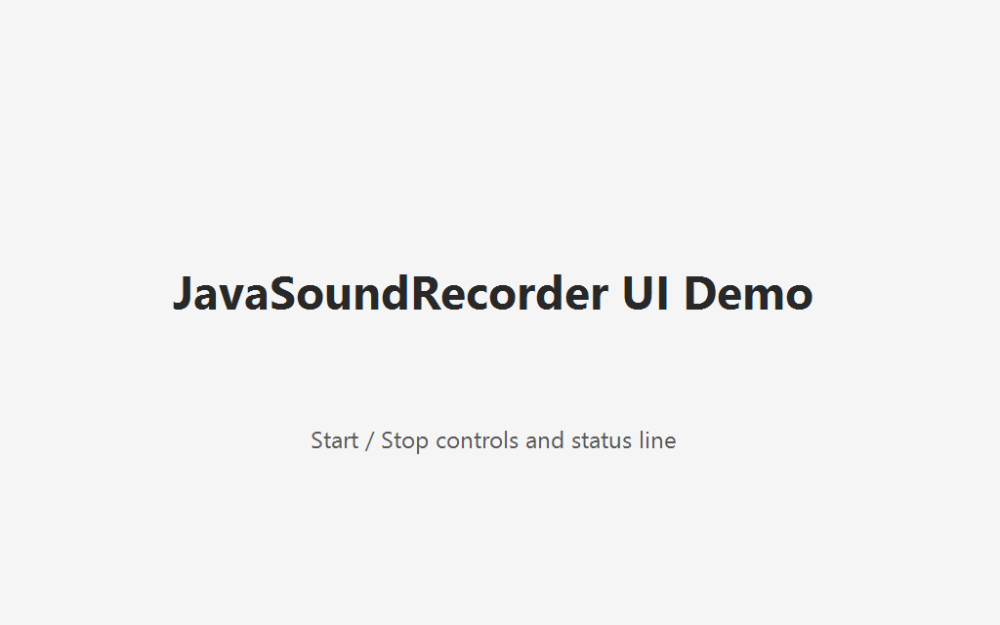
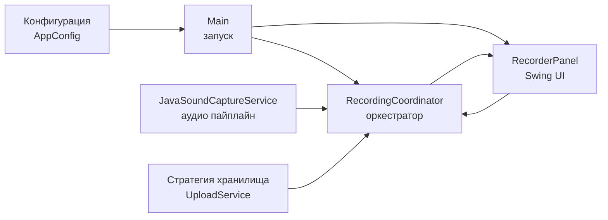

# JavaSoundRecorder


A production-style Java desktop reference project showing a clean audio recording pipeline: capture -> orchestration -> upload strategy -> UI or CLI.

**Read this in**: [English](#english) · [Русский](#русский)

## English

### What this repo demonstrates

- Strong package boundaries (`config`, `audio`, `orchestration`, `storage`, `ui`)
- Deterministic CLI and Swing demo mode
- Reproducible Maven Wrapper setup (`./mvnw` / `mvnw.cmd`)
- Environment-driven configuration
- CI gates: tests, checkstyle, SpotBugs, CodeQL, dependency hygiene, coverage
- GitHub Actions workflow linting with actionlint
- Current stable dependency baseline with documented update policy
- Multi-category tests (unit/integration/ui, plus contract checks and architecture rules)
- Explicit quality policy, release automation, and artifact attestations
- Issue triage templates for bug reports and feature requests

### Architecture at a glance

```mermaid
flowchart LR
    Env[Environment Config\nAppConfig]
    Main[Main\nbootstrap]
    Capture[JavaSoundCaptureService\naudio pipeline]
    Cohesion[RecordingCoordinator\norchestration]
    Upload[Storage Strategy\n(UploadService)]
    UI[RecorderPanel\nSwing UI]

    Env --> Main
    Main --> Cohesion
    Main --> UI
    Capture --> Cohesion
    Upload --> Cohesion
    Cohesion --> UI
    UI --> Cohesion
```

### Features

- **Default one-shot workflow**: records once for `JAVASOUNDRECORDER_RECORDING_DURATION_MS` and uploads (when enabled).
- **Upload abstraction**: `UploadService` strategy (Dropbox, local disk fallback, noop).
- **Defensive configuration**: strict booleans, normalized Dropbox paths, blank-value fallbacks.
- **Safe concurrent behavior**: async orchestration with single-flight guard, cancel support, and lifecycle cleanup.
- **UI workflow**: `Start/Stop`, status labels, run-state lock, and EDT-safe async updates.
- **Observability**: structured logs and strict test naming convention.

### Quickstart

```bash
git clone https://github.com/krotname/JavaSoundRecorder.git
cd JavaSoundRecorder
./mvnw clean verify
```

On Windows, use `mvnw.cmd` instead of `./mvnw`.

#### Run CLI

```bash
./mvnw -q exec:java
```

Defaults: `60000` (milliseconds) and recordings folder `~/JavaSoundRecorder/recordings`.

```bash
./mvnw -q exec:java \
  -Dexec.mainClass=com.krotname.javasoundrecorder.Main \
  -Dexec.args="--ui"
```

#### Docker

```bash
./mvnw -q package
docker build -t javasoundrecorder .
docker run --rm javasoundrecorder
```

### Configuration

| Environment variable | Purpose |
|---|---|
| `JAVASOUNDRECORDER_RECORDING_DURATION_MS` | recording duration in milliseconds |
| `JAVASOUNDRECORDER_RECORDING_DIRECTORY` | output folder for WAV files |
| `DROPBOX_ACCESS_TOKEN` | Dropbox API token |
| `JAVASOUNDRECORDER_DROPBOX_UPLOAD_FOLDER` | remote folder path |
| `JAVASOUNDRECORDER_UPLOAD_ENABLED` | explicit enable flag (`true/false`) |

Invalid boolean values fail fast. Dropbox upload folders are normalized to absolute Dropbox paths.

### Demo surface


To refresh this screenshot after a UI change, run `./mvnw -q -Dexec.mainClass=com.krotname.javasoundrecorder.Main -Dexec.args="--ui"` and capture it from the opened demo.

### Test strategy

- `*UnitTest` — pure in-memory behavior and branching.
- `*IntegrationTest` — cross-layer behavior with temp directories and real I/O.
- `*UiTest` — Swing component behavior and event-dispatch-thread safety.
- `*SmokeTest` / `*ContractTest` — minimal production-path checks for public API and transport assumptions.
- `ArchitectureUnitTest` — package-cycle guard and no UI-driven dependency drift checks.

Run explicitly by category:

```bash
./mvnw -q -Dtest=*UnitTest test
./mvnw -q -Dtest=*IntegrationTest test
./mvnw -q -Dtest=*UiTest test
./mvnw -q -Dtest='*SmokeTest,*ContractTest' test
./mvnw -q -Dtest=ArchitectureUnitTest test
```

Coverage and quality gate:

```bash
./mvnw -q verify
```

This enforces configured line/branch thresholds in `pom.xml`.

### Repository quality surface

- `.github/workflows/ci.yml`: CI with unit/integration/ui/contract/smoke/architecture tests, coverage gate, checkstyle, SpotBugs, and dependency review.
- `.github/workflows/actionlint.yml`: static validation for GitHub Actions workflow files.
- Maven Wrapper: reproducible local and CI builds via Maven 3.9.16.
- GitHub Actions hardening: scoped token permissions, job timeouts, concurrency controls, and non-persistent checkout credentials.
- GitHub Actions are pinned to immutable commit SHAs; Docker images are pinned by digest.
- Maven Wrapper validates the Maven distribution with a SHA-256 checksum.
- Default branch governance is documented in `docs/GOVERNANCE.md`.
- `.github/workflows/codeql.yml`: static security analysis
- `.github/workflows/scorecard.yml`: OSSF scorecards check for supply-chain posture.
- `.github/workflows/release.yml`: verified tag releases with checksums, CycloneDX SBOM (JSON/XML), and GitHub artifact attestations.
- `pom.xml`: SpotBugs bytecode analysis and CycloneDX SBOM generation (JSON/XML) are wired into the Maven lifecycle.
- `.github/ISSUE_TEMPLATE`: bug report and feature request templates
- `checkstyle` config: `src/main/resources/checkstyle/google_checks.xml`
- Dependency policy: `CHANGELOG.md`, `CONTRIBUTING.md`, `SECURITY.md`, `CODE_OF_CONDUCT.md`
- Dependency baseline: `docs/DEPENDENCY_POLICY.md`
- License: `LICENSE` (GNU GPL-3.0)
- `docs/QUALITY.md`: scoring-oriented quality evidence and workflow summary

### Documentation set

- [`docs/ARCHITECTURE.md`](docs/ARCHITECTURE.md)
- [`docs/USAGE.md`](docs/USAGE.md)
- [`docs/TEST_PLAN.md`](docs/TEST_PLAN.md)
- [`docs/QUALITY.md`](docs/QUALITY.md)
- [`docs/GOVERNANCE.md`](docs/GOVERNANCE.md)
- [`docs/DEPENDENCY_POLICY.md`](docs/DEPENDENCY_POLICY.md)
- [`docs/SUPPLY_CHAIN.md`](docs/SUPPLY_CHAIN.md)

### What's not included

- This is a compact portfolio project; it intentionally avoids heavy external frameworks and focuses on clean, testable Java core.
- No secrets are committed to source.

## Русский

### Что показывает репозиторий

- Чёткие слои: `config`, `audio`, `orchestration`, `storage`, `ui`.
- Работа как через CLI, так и через Swing UI (`--ui`).
- Воспроизводимая сборка через Maven Wrapper (`./mvnw` / `mvnw.cmd`).
- Настройка через переменные окружения.
- Проверки CI: тесты, checkstyle, SpotBugs, CodeQL, coverage, правила сборки.
- Линтинг GitHub Actions workflow-файлов через actionlint.
- Актуальный stable baseline зависимостей с отдельной политикой обновления.
- Многоуровневое тестирование: unit / integration / ui / контрактные проверки.
- Дополнительно: архитектурные проверки слоёв через ArchUnit.
- Проверяется корректная остановка фоновой записи и EDT-safe обновление Swing UI.

### Архитектура



### Запуск

```bash
git clone https://github.com/krotname/JavaSoundRecorder.git
cd JavaSoundRecorder
./mvnw clean verify
```

В Windows используйте `mvnw.cmd` вместо `./mvnw`.

#### Запуск CLI

```bash
./mvnw -q exec:java
```

По умолчанию выполняется одноразовая запись.

```bash
./mvnw -q exec:java -Dexec.mainClass=com.krotname.javasoundrecorder.Main -Dexec.args="--ui"
```

#### Запуск через Docker

```bash
./mvnw -q package
docker build -t javasoundrecorder .
docker run --rm javasoundrecorder
```

### Конфигурация

| Переменная | Назначение |
|---|---|
| `JAVASOUNDRECORDER_RECORDING_DURATION_MS` | Длительность записи (мс) |
| `JAVASOUNDRECORDER_RECORDING_DIRECTORY` | Каталог для WAV файлов |
| `DROPBOX_ACCESS_TOKEN` | Токен Dropbox |
| `JAVASOUNDRECORDER_DROPBOX_UPLOAD_FOLDER` | Папка на Dropbox |
| `JAVASOUNDRECORDER_UPLOAD_ENABLED` | Включить/выключить загрузку |

Некорректные boolean-значения завершаются ошибкой. Папка Dropbox нормализуется к абсолютному пути Dropbox.

### Тестирование

```bash
./mvnw -q -Dtest=*UnitTest test
./mvnw -q -Dtest=*IntegrationTest test
./mvnw -q -Dtest=*UiTest test
./mvnw -q -Dtest='*SmokeTest,*ContractTest' test
./mvnw -q -Dtest=ArchitectureUnitTest test
```

Проверка полного покрытия и политик:

```bash
./mvnw -q verify
```

### Качество и документация

- `.github/workflows/ci.yml` — запуск по категориям тестов и проверкам, включая architecture tests.
- `.github/workflows/actionlint.yml` — статическая проверка GitHub Actions workflow-файлов.
- Maven Wrapper — воспроизводимая локальная и CI-сборка на Maven 3.9.16.
- GitHub Actions hardening: ограниченные permissions, timeout для job, concurrency и checkout без сохранения credentials.
- GitHub Actions закреплены по immutable commit SHA; Docker images закреплены по digest.
- Maven Wrapper проверяет Maven distribution по SHA-256 checksum.
- Правила default branch описаны в `docs/GOVERNANCE.md`.
- `.github/workflows/ci.yml` также запускает `Dependency Review` для pull request.
- `.github/workflows/codeql.yml` — анализ безопасности.
- `.github/workflows/scorecard.yml` — OSSF Scorecards для оценки supply-chain-подхода.
- `.github/workflows/release.yml` — проверенные релизы с checksum, SBOM (JSON/XML) и GitHub artifact attestations.
- `pom.xml` — checkstyle/SpotBugs/jacoco/coverage gates и сборка включает генерацию SBOM (JSON/XML).
- `docs/DEPENDENCY_POLICY.md` — baseline версий и правила обновления зависимостей.
- `.github/dependabot.yml` — автоматическое обновление зависимостей Maven/Actions.
- `.github/ISSUE_TEMPLATE/` — шаблоны для багов и фич.
- `CHANGELOG.md`, `CONTRIBUTING.md`, `SECURITY.md`, `CODE_OF_CONDUCT.md`.
- Лицензия: `LICENSE` (GNU General Public License v3.0).
- Доп. docs: `docs/ARCHITECTURE.md`, `docs/TEST_PLAN.md`, `docs/USAGE.md`, `docs/QUALITY.md`, `docs/GOVERNANCE.md`, `docs/DEPENDENCY_POLICY.md`, `docs/SUPPLY_CHAIN.md`.
