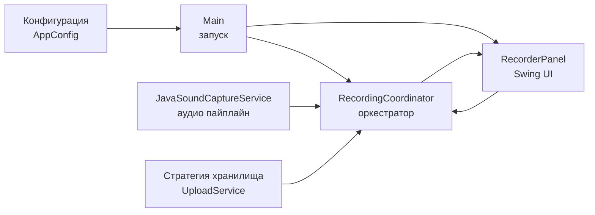

# JavaSoundRecorder

[](https://github.com/krotname/JavaSoundRecorder/actions/workflows/ci.yml?query=branch%3Amaster)
[](https://github.com/krotname/JavaSoundRecorder/actions/workflows/codeql.yml?query=branch%3Amaster)
[](https://codecov.io/gh/krotname/JavaSoundRecorder)
[](https://securityscorecards.dev/viewer/?uri=github.com/krotname/JavaSoundRecorder)
[](https://github.com/krotname/JavaSoundRecorder/releases/latest)
[](LICENSE)
[](https://adoptium.net/)
[](https://www.bestpractices.dev/projects/13147)

JavaSoundRecorder — Java 21 desktop-проект для записи звука с микрофона, демонстрирующий аккуратную архитектуру, воспроизводимую сборку, многоуровневые тесты, CI, coverage и supply-chain quality gates.

## Что показывает репозиторий

- Чёткие слои: `config`, `audio`, `orchestration`, `storage`, `ui`.
- Работа как через CLI, так и через Swing UI (`--ui`).
- Воспроизводимая сборка через Maven Wrapper (`./mvnw` / `mvnw.cmd`).
- Настройка через переменные окружения.
- Проверки CI: тесты, checkstyle, SpotBugs, CodeQL, coverage, правила сборки.
- Линтинг GitHub Actions workflow-файлов через actionlint.
- Актуальный stable baseline зависимостей с отдельной политикой обновления.
- Многоуровневое тестирование: unit / integration / ui / контрактные проверки.
- Дополнительно: архитектурные проверки слоёв через ArchUnit.
- Проверяется корректная остановка фоновой записи и EDT-safe обновление Swing UI.

## Архитектура



## Запуск

```bash
git clone https://github.com/krotname/JavaSoundRecorder.git
cd JavaSoundRecorder
./mvnw clean verify
```

В Windows используйте `mvnw.cmd` вместо `./mvnw`.

### Запуск CLI

```bash
./mvnw -q exec:java
```

По умолчанию выполняется одноразовая запись.

```bash
./mvnw -q exec:java -Dexec.mainClass=com.krotname.javasoundrecorder.Main -Dexec.args="--ui"
```

### Запуск через Docker

```bash
./mvnw -q package
docker build -t javasoundrecorder .
docker run --rm javasoundrecorder
```

## Конфигурация

| Переменная | Назначение |
|---|---|
| `JAVASOUNDRECORDER_RECORDING_DURATION_MS` | Длительность записи (мс) |
| `JAVASOUNDRECORDER_RECORDING_DIRECTORY` | Каталог для WAV файлов |
| `DROPBOX_ACCESS_TOKEN` | Токен Dropbox |
| `JAVASOUNDRECORDER_DROPBOX_UPLOAD_FOLDER` | Папка на Dropbox |
| `JAVASOUNDRECORDER_UPLOAD_ENABLED` | Включить/выключить загрузку |

Некорректные boolean-значения завершаются ошибкой. Папка Dropbox нормализуется к абсолютному пути Dropbox.

## Тестирование

```bash
./mvnw -q -Dtest=*UnitTest test
./mvnw -q -Dtest=*IntegrationTest test
./mvnw -q -Dtest=*UiTest test
./mvnw -q -Dtest='*SmokeTest,*ContractTest' test
./mvnw -q -Dtest=ArchitectureUnitTest test
```

Проверка полного покрытия и политик:

```bash
./mvnw -q verify
```

## Качество и документация

- `.github/workflows/ci.yml` — запуск по категориям тестов и проверкам, включая architecture tests.
- `.github/workflows/actionlint.yml` — статическая проверка GitHub Actions workflow-файлов.
- Maven Wrapper — воспроизводимая локальная и CI-сборка на Maven 3.9.16.
- GitHub Actions hardening: ограниченные permissions, timeout для job, concurrency и checkout без сохранения credentials.
- GitHub Actions закреплены по immutable commit SHA; Docker images закреплены по digest.
- Maven Wrapper проверяет Maven distribution по SHA-256 checksum.
- Правила default branch описаны в `docs/GOVERNANCE.md`.
- `.github/workflows/ci.yml` также запускает `Dependency Review` для pull request.
- `.github/workflows/codeql.yml` — анализ безопасности.
- `.github/workflows/scorecard.yml` — OSSF Scorecards для оценки supply-chain-подхода.
- `.github/workflows/release.yml` — проверенные релизы с checksum, SBOM (JSON/XML) и GitHub artifact attestations.
- `pom.xml` — checkstyle/SpotBugs/jacoco/coverage gates и сборка включает генерацию SBOM (JSON/XML).
- `docs/DEPENDENCY_POLICY.md` — baseline версий и правила обновления зависимостей.
- `.github/dependabot.yml` — автоматическое обновление зависимостей Maven/Actions.
- `.github/ISSUE_TEMPLATE/` — шаблоны для багов и фич.
- `CHANGELOG.md`, `CONTRIBUTING.md`, `SECURITY.md`, `CODE_OF_CONDUCT.md`.
- Лицензия: `LICENSE` (GNU General Public License v3.0).
- Доп. docs: `docs/ARCHITECTURE.md`, `docs/TEST_PLAN.md`, `docs/USAGE.md`, `docs/QUALITY.md`, `docs/GOVERNANCE.md`, `docs/DEPENDENCY_POLICY.md`, `docs/SUPPLY_CHAIN.md`.
