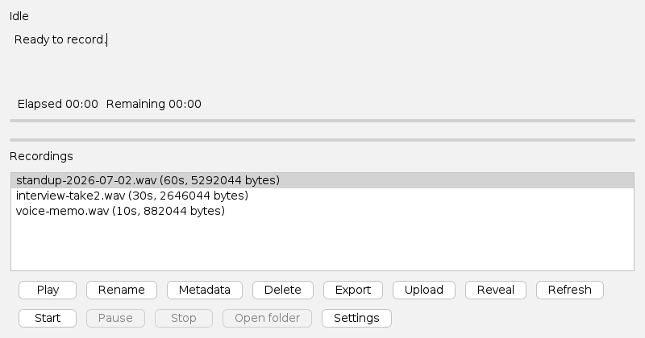
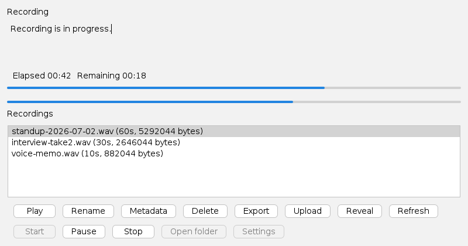
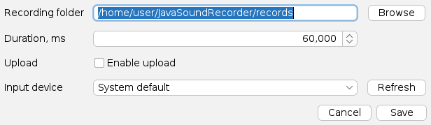

# Usage Guide

## CLI mode (default)

```bash
./mvnw -q exec:java
```

The process runs one capture cycle and exits after upload decision is resolved.
On Windows, use `mvnw.cmd` instead of `./mvnw`.

## UI mode

```bash
./mvnw -q -Dexec.mainClass=com.krotname.javasoundrecorder.Main -Dexec.args="--ui"
```

The UI exposes `Start` and `Stop` controls, status text, wrapped details, and an `Open folder`
action for the last successful recording.





- `Start` begins one bounded recording cycle.
- `Pause` pauses the active capture and changes to `Resume`; paused time does not count toward the configured duration.
- `Stop` requests cancellation and shows `Stopping...` until the workflow reaches a final state.
- A completed recording shows `Saved` with the full output path in the details area.
- `Open folder` opens the folder for the last successfully saved recording.
- If no compatible microphone input line is available, the UI disables `Start` and shows a preflight message.
- `Settings` opens recording folder, duration, upload, and input-device settings. Saved settings are applied to the
  current UI session when no recording is running.

  

- The `Recordings` list shows WAV files from the active recording folder.
- Library actions support `Play`, `Rename`, `Metadata`, `Delete`, `Export`, `Upload`, `Reveal`, and `Refresh`.
- `Metadata` saves title, artist, and comment in a UTF-8 sidecar file next to the WAV.
- `Export` supports WAV and FLAC output now, reports a SHA-256 checksum, and shows clear errors for export profiles
  that still need codec support.
- `Upload` retries upload for the selected local recording using the active Dropbox configuration.
- Live meters show elapsed time, remaining time, recording progress, and approximate microphone level.

Keyboard shortcuts:

- `Ctrl+R` starts recording when `Start` is enabled.
- `Space` pauses or resumes while recording is active.
- `Esc` stops the active recording.

Cancelled in-progress captures remove their unfinished WAV file. A fully captured recording remains on disk even if
later upload work is disabled or fails.

### User settings

UI settings are saved in:

```text
~/JavaSoundRecorder/settings.properties
```

Environment variables still take precedence over saved UI settings. This keeps CLI, CI, and scripted runs reproducible.

### Capturing UI screenshots for the docs

- Refresh all three assets together so they show the same theme and states: `assets/screenshot-ui.png` (idle with
  recordings), `assets/screenshot-recording.png` (recording in progress), and `assets/screenshot-settings.png`
  (settings dialog).
- Start UI mode and capture the window, or drive `RecorderPanel`/`SettingsDialog` directly with sample data under a
  virtual display for repeatable, uncluttered captures.

## Containers

Build and run:

```bash
./mvnw -q package
docker compose up --build
```

You can disable upload in container mode using:

```bash
environment:
  - JAVASOUNDRECORDER_UPLOAD_ENABLED=false
```

## Output locations

- Recordings default to `~/JavaSoundRecorder/recordings`.
- Local upload fallback target folder is controlled by integration setup or test fixtures.
- The UI library scans the active recording folder for `.wav` files and sorts them newest first.
- Recording metadata is stored as `<recording>.wav.metadata.properties` next to each WAV file.

## Configuration parsing

- `JAVASOUNDRECORDER_UPLOAD_ENABLED` accepts only `true` or `false`.
- Blank `JAVASOUNDRECORDER_RECORDING_DIRECTORY` falls back to the default recordings folder.
- `JAVASOUNDRECORDER_DROPBOX_UPLOAD_FOLDER` is normalized to an absolute Dropbox path.
- `JAVASOUNDRECORDER_AUDIO_INPUT` selects a Java Sound input mixer by name.

## Safety notes

- Never commit real `DROPBOX_ACCESS_TOKEN` values.
- Keep repository clean from generated artifacts; run `./mvnw clean` before commit if needed.
